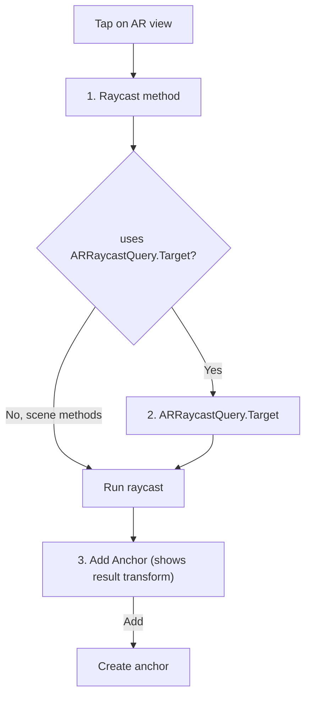

# WeAReLearning

An interactive **ARKit + RealityKit** playground for learning how `ARWorldTrackingConfiguration`, anchors, and raycasting actually behave on device. Built with UIKit (programmatic, MVVM) as a Swift Conference 2026 demo.

Instead of hard-coding a single AR setup, WeAReLearning exposes the configuration surface as live controls, so you can flip options, place anchors different ways, and inspect the difference between what ARKit tracks (`ARAnchor`) and what RealityKit draws (`AnchorEntity`).

## Features

### Live ARWorldTracking configuration
A draggable overlay lets you change the session configuration in real time and re-run it:

- **ARConfiguration** — `worldAlignment` (gravity / gravityAndHeading / camera), `planeDetection` (horizontal / vertical), `environmentTexturing`, `isLightEstimationEnabled`, `sceneReconstruction`
- **ARView.Environment** — `SceneUnderstanding.collision` (so the reconstructed mesh can be raycast against)
- **ARSession.RunOptions** — applied on the explicit Run action
- **Debug visualizations** — feature points and world origin
- Run / Pause / Reset controls

### Tap-to-place anchors (three-step flow)
Tapping the scene walks through three dialogs:



- **Raycast methods:** `ARSession.raycast`, `ARSession.trackedRaycast`, `ARView.raycast`, `ARView.scene.raycast` (with and without LiDAR mesh)
- **ARRaycastQuery.Target:** `existingPlaneGeometry`, `existingPlaneInfinite`, `estimatedPlane`
- **Anchor kind (multi-select, at least one):**
  - *With ARAnchor + With AnchorEntity* — session anchor that is rendered
  - *With ARAnchor only* — exists in the session but is not rendered
  - *With AnchorEntity only* — render-only, no backing `ARAnchor`
- **AnchorEntity target:** World / Plane / Camera

### Anchor inspector
A slide-in panel shows both sides of the anchor story, treating `ARAnchor` as the source of truth and `AnchorEntity` as its render projection:

- **ARAnchor tab** — type, name, UUID, transform, and whether it is *Rendered*
- **AnchorEntity tab** — type, name, UUID, color, transform, and whether it is *Anchored*
- Search by name and filter by type

A tap ripple makes touches visible (handy for screen recordings), and tapping an existing anchor shows its info.

## Requirements

- Xcode with the iOS 26 SDK
- iOS **26.0+**
- An ARKit-capable device (Apple A12 Bionic or newer) — the camera and world tracking do not run in the Simulator
- A device with a **LiDAR Scanner** for scene reconstruction / mesh raycasting features

## Getting started

```bash
git clone <your-repo-url>
cd WeAReLearning
open WeAReLearning.xcodeproj
```

1. Select your development team in **Signing & Capabilities** (bundle id defaults to `com.yafonia.WeAReLearning`).
2. Choose a physical device.
3. Build and run, then grant camera permission when prompted.

## Project structure

```
WeAReLearning/
├── App/                 # AppDelegate, SceneDelegate
├── Models/              # ARCardItem, AnchorTapInfo
├── ViewModels/          # HomeViewModel, ARWorldTrackingViewModel
├── Views/
│   ├── Home/            # Home screen (card list)
│   ├── ARWorldTracking/ # ARView, config overlay, anchor inspector, dialogs
│   └── Shared/
└── Services/
```

## Architecture

- **MVVM** with programmatic UIKit (no storyboards for the AR screen)
- `ARWorldTrackingViewModel` owns the `ARSession`/`ARWorldTrackingConfiguration`, applies configuration changes, and manages the anchor lifecycle
- The view model acts as `ARSessionDelegate`: it builds a render `AnchorEntity` for each added `ARAnchor`, so user anchors and ARKit-detected planes flow through the same path
- The UI reads the session's anchors as ground truth and renders `AnchorEntity` values purely for display
